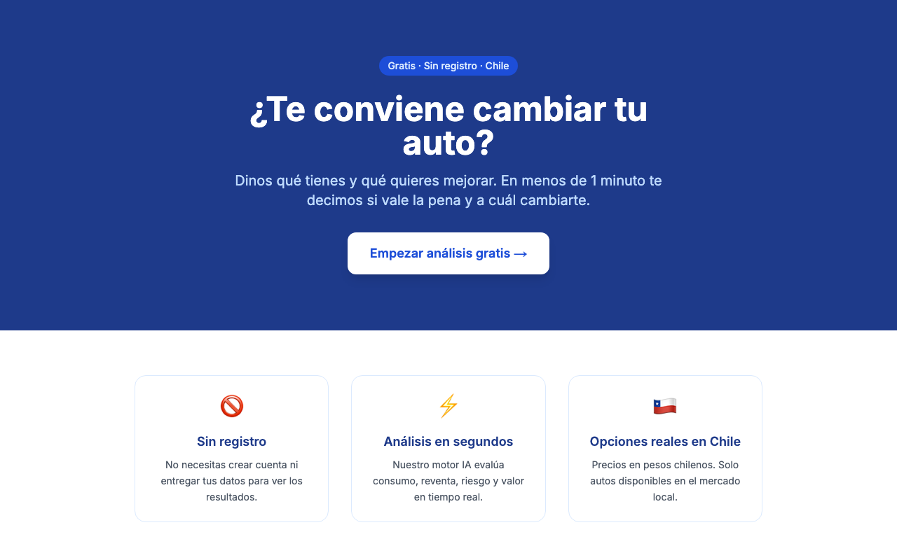
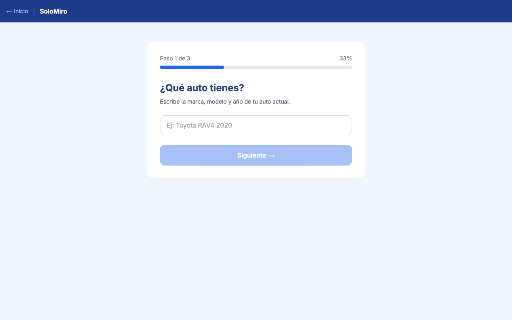
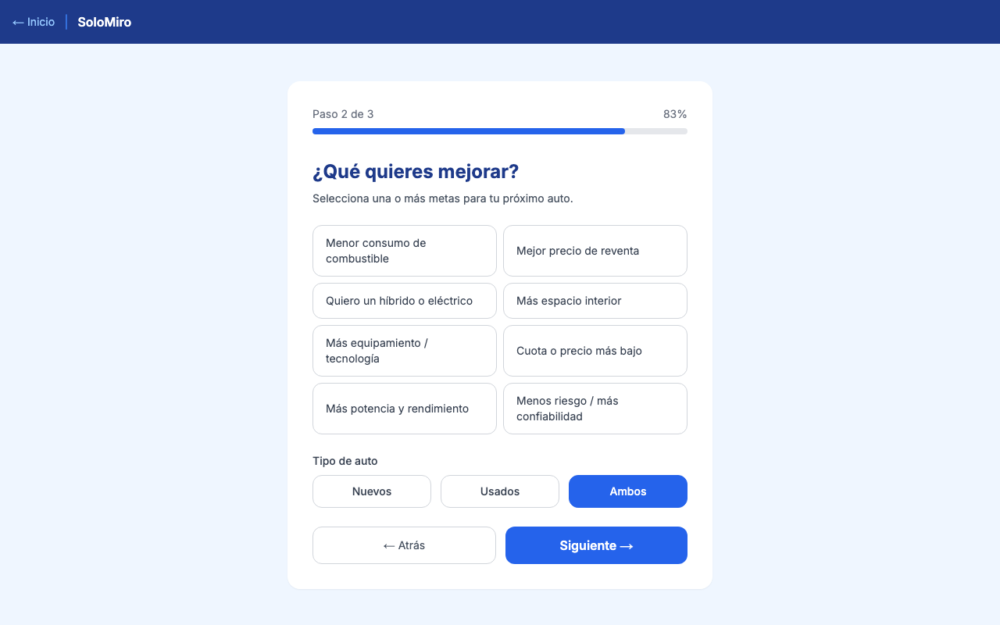

# SoloMiro

**AI-powered platform that helps Chilean drivers decide whether to keep or switch their car.**


---

## The Problem

Most Chileans make car-switching decisions based on sticker price alone — ignoring how fuel type, annual mileage, patente, insurance, and maintenance costs compound over 3–5 years. A petrol car at $8M may cost $2M/year to run; an EV at $14M may cost $800k/year. The switch pays back in 4 years. Most people never do that math.

## The Solution

SoloMiro collects your current car's real usage (fuel type, weekly km, city, maintenance costs) and your goals (lower fuel bill, less maintenance, go electric). It calculates the **total cost of ownership**, scores matching candidates from a curated Chilean market catalog, and delivers a personalized AI recommendation — including the exact payback period if you switch.

The AI provider (Claude, GPT-4o, or Gemini) is swappable via a single environment variable.

---

## Screenshots

| Landing | Step 1 — Your car | Step 2 — Your goals |
|---|---|---|
|  |  |  |

---

## Features

- **Total cost of ownership calculator** — fuel, patente, insurance, maintenance, depreciation
- **Candidate scoring** — ranks market options against user goals (fuel type, budget, km range)
- **AI recommendation** — personalized analysis with payback period, trade-offs, and final verdict
- **Multi-provider AI** — Claude / GPT-4o / Gemini switchable via `AI_PROVIDER` env var
- **Full-stack** — Next.js 14 frontend + FastAPI backend + PostgreSQL
- **21 passing tests** — calculator, recommender, and API endpoints with mock AI (no API calls needed)
- **Docker Compose** — one command to run frontend + backend + database
- **CI/CD** — GitHub Actions on every push

---

## Architecture

```
User Browser (Next.js 14 — App Router + Tailwind CSS)
     │
     │  POST /recommend  { current_car, goals, preferences }
     ▼
FastAPI Backend
  ├─ CarRecommender          — filters catalog, scores candidates by goal fit
  ├─ Calculator              — computes TCO, annual cost, payback period
  ├─ AIService               — abstract interface: Anthropic / OpenAI / Gemini
  │    └─ prompt + scores + costs → personalized recommendation text
  └─ SQLAlchemy + Alembic    — persists recommendations + lead capture
     │
     ├── PostgreSQL (Docker / prod)
     └── SQLite (local dev — zero config)
```

**AI provider abstraction:**
```python
# Switching AI providers is a one-line env change
AI_PROVIDER=anthropic   # → uses Claude
AI_PROVIDER=openai      # → uses GPT-4o
AI_PROVIDER=gemini      # → uses Gemini

# In tests: MockAIProvider — no API calls, no cost, instant
```

---

## Tech Stack

| Layer            | Technology                                        |
|------------------|---------------------------------------------------|
| Frontend         | Next.js 14 (App Router), Tailwind CSS             |
| Backend          | FastAPI, Python 3.11                              |
| AI               | Anthropic Claude / OpenAI GPT-4o / Google Gemini  |
| ORM + Migrations | SQLAlchemy 2.0 + Alembic                          |
| Database         | PostgreSQL (Docker) / SQLite (local dev)          |
| Testing          | pytest — 21 tests, MockAIProvider                 |
| CI/CD            | GitHub Actions                                    |
| Containerization | Docker + Docker Compose                           |

---

## Quickstart

### Docker (recommended)

```bash
git clone https://github.com/Arcan17/solomiro.git
cd solomiro

cp backend/.env.example backend/.env
# Edit backend/.env → set AI_API_KEY=your-key

docker compose up --build
# Frontend: http://localhost:3000
# Backend docs: http://localhost:8000/docs
```

### Local Development

**Backend:**
```bash
cd backend
python -m venv .venv && source .venv/bin/activate
pip install -r requirements.txt
cp .env.example .env          # set AI_API_KEY
mkdir -p data
alembic upgrade head
uvicorn app.main:app --reload --port 8000
# Docs: http://localhost:8000/docs
```

**Frontend:**
```bash
cd frontend
npm install
NEXT_PUBLIC_API_URL=http://localhost:8000 npm run dev
# App: http://localhost:3000
```

---

## Environment Variables

| Variable           | Default                          | Description                                   |
|--------------------|----------------------------------|-----------------------------------------------|
| `AI_PROVIDER`      | `anthropic`                      | AI backend: `anthropic`, `openai`, `gemini`   |
| `AI_API_KEY`       | *(required)*                     | API key for the selected provider             |
| `AI_MODEL`         | `claude-sonnet-4-5`              | Model ID to use                               |
| `DATABASE_URL`     | `sqlite:///./data/solomiro.db`   | SQLAlchemy connection string                  |
| `ALLOWED_ORIGINS`  | `http://localhost:3000`          | CORS origins (comma-separated)                |
| `FUEL_PRICE_95`    | `1100`                           | CLP per litre of 95-octane gasoline           |
| `FUEL_PRICE_DIESEL`| `1050`                           | CLP per litre of diesel                       |
| `FUEL_PRICE_KWH`   | `120`                            | CLP per kWh of electricity                    |
| `LOG_LEVEL`        | `INFO`                           | Python logging level                          |

**Getting an API key:**

| Provider | Link |
|----------|------|
| Anthropic (default) | [console.anthropic.com](https://console.anthropic.com) → API Keys |
| OpenAI | [platform.openai.com/api-keys](https://platform.openai.com/api-keys) |
| Gemini | [aistudio.google.com/app/apikey](https://aistudio.google.com/app/apikey) |

---

## Running Tests

All tests use SQLite in-memory and `MockAIProvider` — no external API calls or keys required.

```bash
cd backend
pytest tests/ -v
```

```
tests/test_calculator.py    7 passed   ← TCO, annual cost, payback period logic
tests/test_recommender.py   8 passed   ← candidate filtering, scoring, full pipeline
tests/test_api.py           6 passed   ← HTTP endpoints, DB persistence
──────────────────────────────────────
21 passed in ~1s
```

---

## Project Structure

```
solomiro/
├── backend/
│   ├── app/
│   │   ├── main.py              # FastAPI app + routes
│   │   ├── models.py            # SQLAlchemy ORM models
│   │   ├── schemas.py           # Pydantic request/response schemas
│   │   ├── calculator.py        # TCO + savings + payback math
│   │   ├── recommender.py       # Candidate scoring and filtering
│   │   ├── ai_service.py        # AI provider abstraction
│   │   └── providers/
│   │       ├── anthropic.py
│   │       ├── openai.py
│   │       ├── gemini.py
│   │       └── mock.py          # No-cost provider for tests
│   ├── tests/
│   │   ├── test_calculator.py
│   │   ├── test_recommender.py
│   │   └── test_api.py
│   ├── alembic/                 # DB migrations
│   ├── requirements.txt
│   └── .env.example
├── frontend/
│   ├── app/
│   │   ├── page.tsx             # Landing page
│   │   ├── advisor/page.tsx     # Multi-step form
│   │   └── result/page.tsx      # Recommendation display
│   └── components/
├── docs/screenshots/
├── docker-compose.yml
└── .github/workflows/ci.yml
```

---

## Technical Decisions

**Why abstract the AI provider?**
Tying the app to a single LLM creates vendor lock-in and cost risk. The abstraction (`AIService` interface with `Anthropic/OpenAI/Gemini/Mock` implementations) means switching models is a one-line config change — and tests run with zero API cost using `MockAIProvider`.

**Why FastAPI + Next.js instead of a single-framework approach?**
Separating backend and frontend lets both be deployed independently and scaled differently. The backend can serve multiple frontends (mobile app, third-party API) without changes. FastAPI's auto-generated Swagger docs also serve as a live API contract.

**Why Chilean market-specific data?**
Fuel prices, patente (annual registration tax based on car value), and available models differ significantly from other markets. Using localized data (CLP, `FUEL_PRICE_95`, Chilean car catalog) makes recommendations actionable rather than generic.

**Why Alembic for migrations?**
Schema-less ORMs create data integrity issues in production. Alembic gives version-controlled, reviewable, reversible migrations — essential for any app that persists user data.

---

## Known Limitations

- **Curated catalog only** — car options are hardcoded; no live market data scraping yet (roadmap item)
- **No user accounts** — recommendations aren't saved per user; session-based only
- **Chilean market only** — fuel prices, patente, and catalog are Chile-specific
- **Estimates only** — actual insurance and maintenance costs vary significantly by provider and usage

---

## Roadmap

- [ ] Deploy public demo (Vercel frontend + Railway backend)
- [ ] Populate catalog from real MercadoLibre Chile listings
- [ ] Add comparison mode (side-by-side two candidates)
- [ ] Shareable result links
- [ ] User accounts for saved recommendations
- [ ] Spanish-language UI (currently bilingual)

---

## License

MIT
